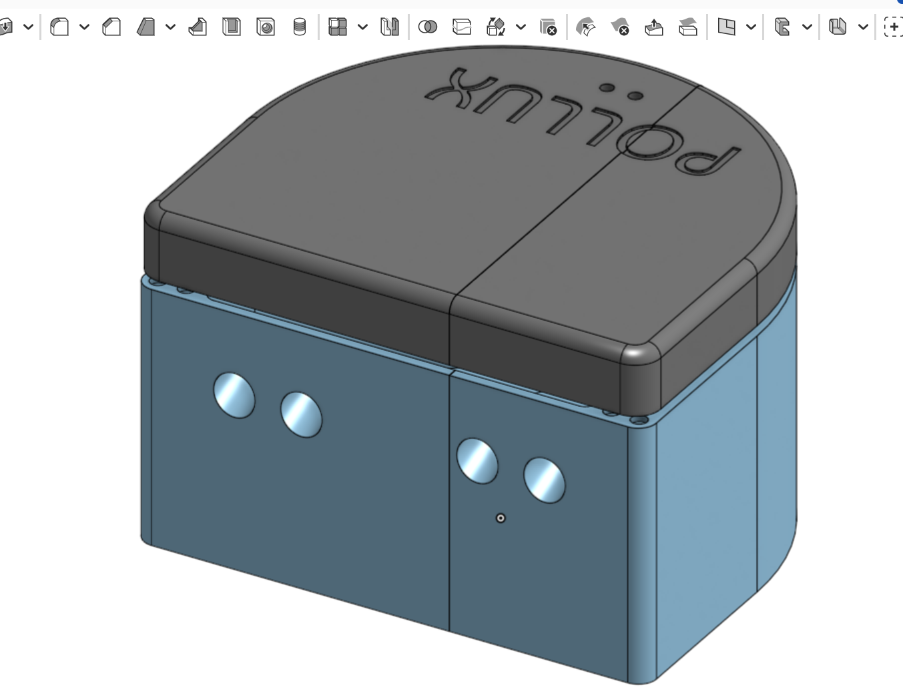
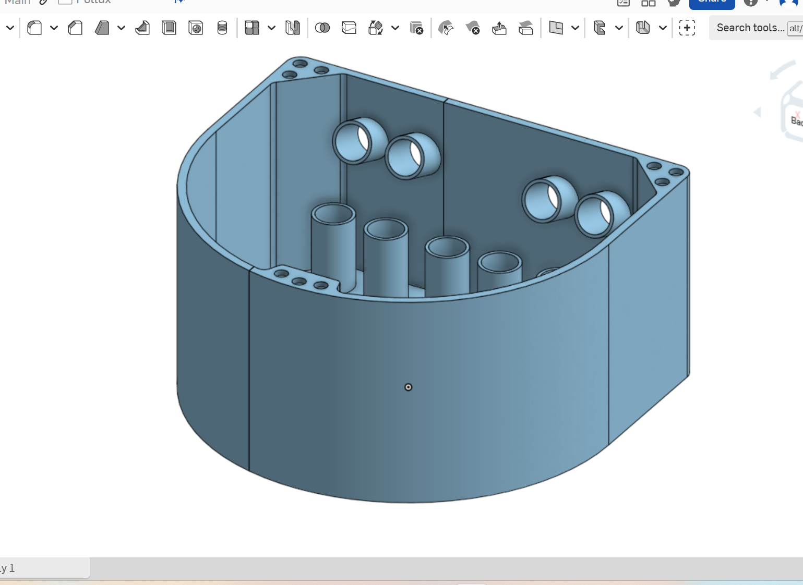
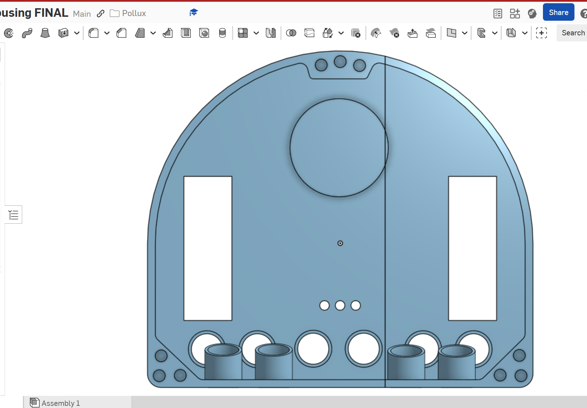
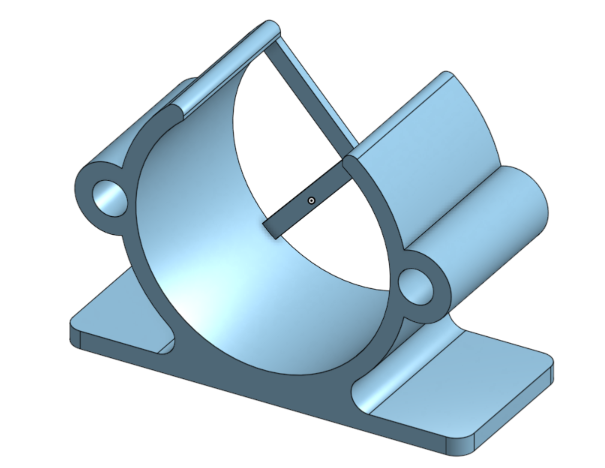
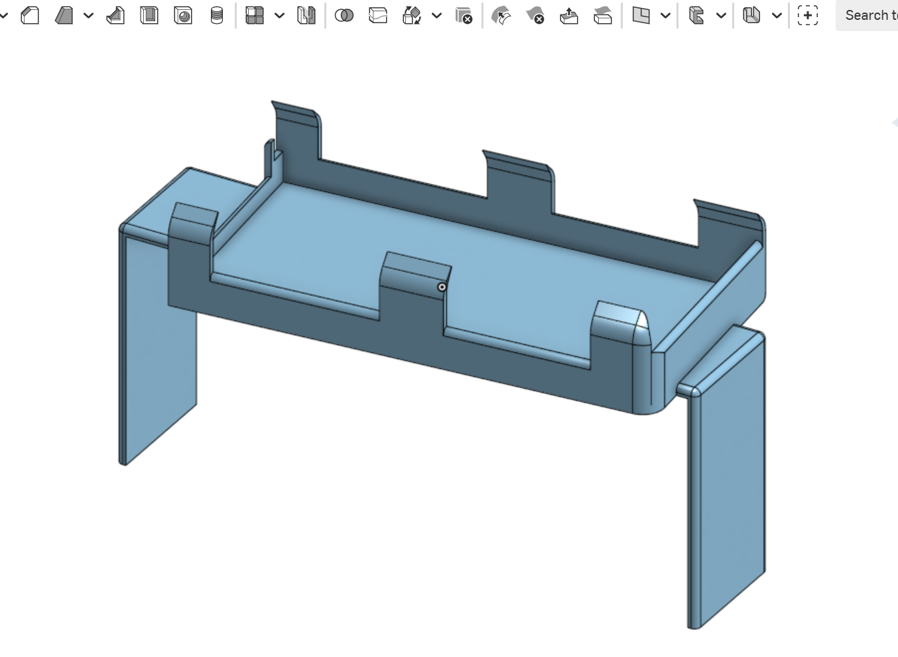
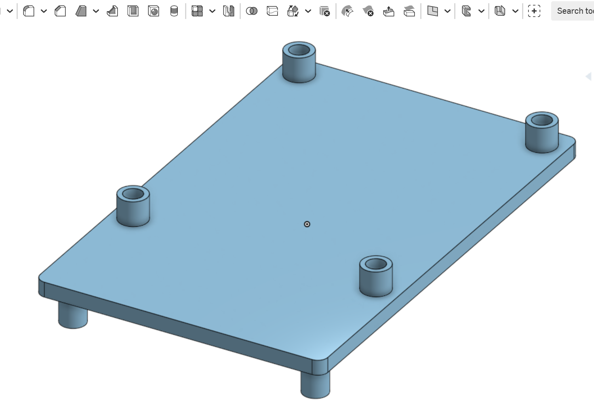
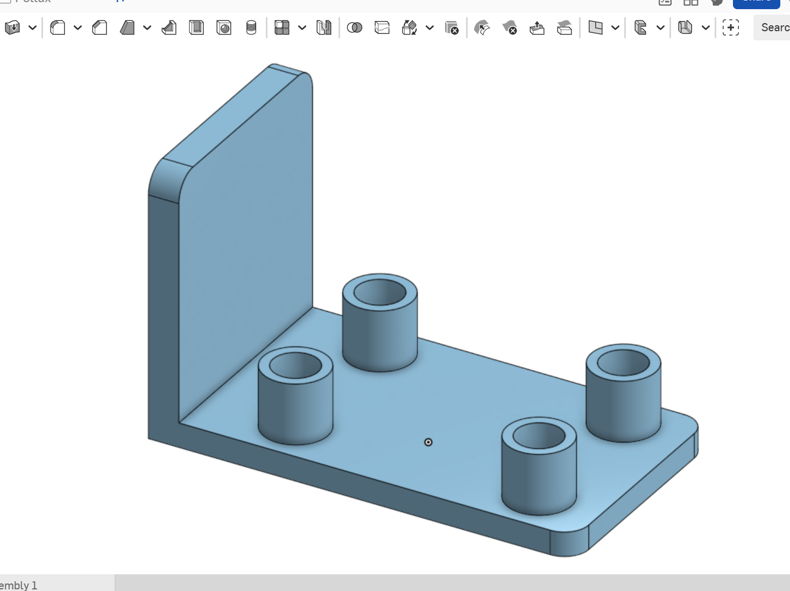

# Pollux-AMR Hardware Report

## Overview
Pollux-AMR is an autonomous countertop-cleaning robot. Its hardware components are designed to detect cliffs (countertop edges), avoid obstacles, and perform UV sanitation.

## Hardware Components
- **Robot Base:** Two motorized wheels, one castor wheel, platform for sensor mounting.
- **Ultrasonic Sensors:** 
  - 3× Downward-facing (cliff detection)
  - 2× Forward-facing (obstacle detection)
- **Adafruit MPU‑6050 IMU:** Accelerometer and gyroscope for orientation and motion data.
- **LED Subsystem:** UV LED strip for sanitization and indicator LEDs for feedback.
- **Stepper Motors & Drivers:** Controlled via a DualMotorController.
- **Raspberry Pi 4 Model B (4GB RAM):** Main computing platform (Ubuntu 20.04 headless).

## Power Requirements
- **Input Voltage:** 5V DC (via Raspberry Pi 4)
- **Motor Driver Voltage:** 6-12V (via external power if necessary)
- **Current Consumption:** ~1-2A under normal operation, higher during motor startup
- **Power Supply Model:** Standard 5V 3A USB-C supply for Raspberry Pi 4

## Setup Instructions
1. **Mount Ultrasonic Sensors:** Secure sensors in the specified positions (3 downward, 2 forward).
2. **Connect IMU (MPU6050):** Wire to Raspberry Pi GPIO (I2C lines).
3. **Motor and Motor Driver:** Wire motor driver to Pi GPIOs and connect motors.
4. **LED Subsystem:** Connect LED strip and indicator LEDs to designated Pi GPIOs.
5. **Final Assembly:** Mount everything securely onto the robot base; ensure proper cable management.

## Schematics and PCB /  CAD
- **CAD Files:**

[Download Final Housing (STEP)](hardware/Final_housing.step)

[Download Motor Mount (STEP)](hardware/Motor_mount.step)

[Download Battery Mount (STEP)](hardware/Battery_mount.step)

[Download PI Mount (STEP)](hardware/PI_mount.step)

[Download IMU Mount (STEP)](hardware/IMU_mount.step)

- **3D Printed Housing Layout**

- **Schematics:** [Provided separately in PDF/ and EDA files]
- **PCB Documentation:** [Provided separately in PCB/ folder]

## Vendor Information & Bill of Materials (BOM)
| Item | Vendor | Model Number |
|:----|:------|:------------|
| Ultrasonic Sensors | Generic | HC-SR04 |
| IMU Sensor | Adafruit | MPU-6050 |
| Stepper Motors | Generic | N/A |
| Motor Driver | Generic | Dual Motor Controller |
| Raspberry Pi | Raspberry Pi Foundation | Pi 4 Model B (4GB) |
| UV LED Strip | Adafruit | UV 395nm LED Strip |

## Reference Materials
- [HC-SR04 Datasheet](https://cdn.sparkfun.com/datasheets/Sensors/Proximity/HCSR04.pdf)
- [MPU-6050 Datasheet](https://invensense.tdk.com/wp-content/uploads/2015/02/MPU-6000-Datasheet1.pdf)
- [Raspberry Pi 4 Documentation](https://www.raspberrypi.org/documentation/)
