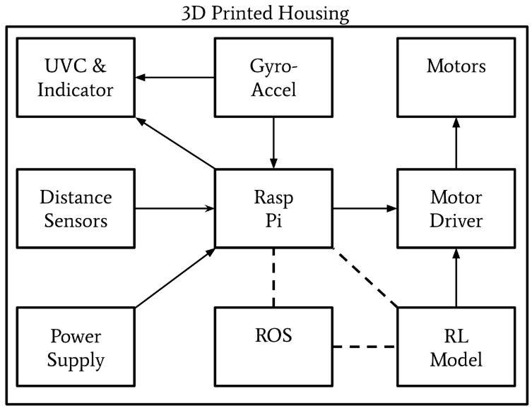
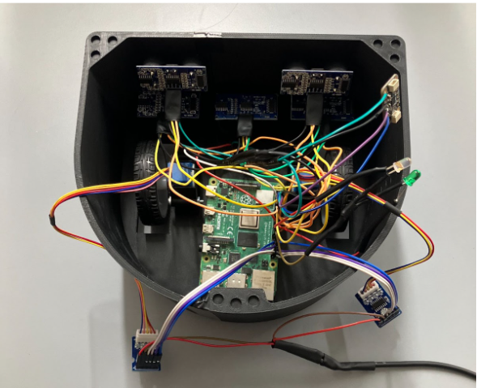
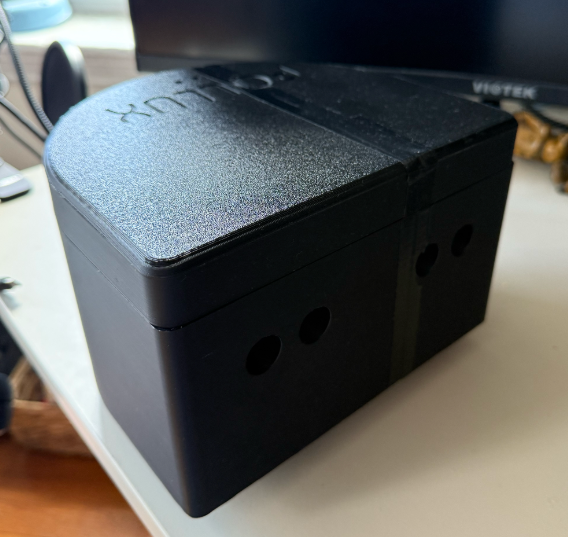

# Pollux-AMR · Hardware Report  
_Last updated: 27 Apr 2025_

---

## 1 · Overview  
Pollux-AMR is an autonomous countertop-cleaning robot that:  

* **Detects cliffs** (counter-top edges) with three downward-facing HC-SR04 sensors.  
* **Avoids obstacles** with two forward-facing HC-SR04 sensors.  
* **Performs UV-C sanitation** via an LED strip that is automatically disabled if the robot tilts.  
* **Runs untethered** on a Raspberry Pi 4 Model B (Ubuntu 20.04 headless, ROS Noetic).

---

## 2 · Hardware Components  

| Sub-assembly | Notes |
|--------------|-------|
| **Robot base** | Two DC gearmotors for drive, one caster for balance, 3-D-printed chassis. |
| **Ultrasonic array** | 3 × downward (cliff) + 2 × forward (obstacle). |
| **IMU** | Adafruit MPU-6050 accelerometer / gyroscope (I²C). |
| **LED subsystem** | UV-C strip for sanitation + indicator LEDs. |
| **Drive electronics** | Dual H-bridge; controlled by `motor_cmd_node.py`. |
| **Compute** | Raspberry Pi 4 (4 GB RAM) running all ROS nodes. |

---

## 3 · Power Requirements  

| Rail | Voltage | Typical Current | Source |
|------|---------|-----------------|--------|
| 5 V (logic / UV-C) | 5 V DC | 1 A | USB-C PSU (3 A headroom) |
| Motor rail | 6 – 12 V | 0.8 – 1.5 A (startup) | External DC boost / Li-ion pack |

> **Hint:** Brown-outs during motor spin-up are the #1 cause of random Pi resets—use separate supplies or a 2 A buck converter.

---

## 4 · Setup Instructions  

1. **Mount ultrasonic sensors** – three downward at the front edge, two forward on the bumper.  
2. **Wire the MPU-6050** – SDA to GPIO 2, SCL to GPIO 3, 3V3 & GND to Pi header.  
3. **Install motors & driver** – connect IN1/IN2/ENA/ENB to Pi GPIOs as specified in `motor_cmd_node.py`.  
4. **Connect LEDs** – UV-C strip to FET driver (GPIO 18 PWM), status LEDs to GPIO 23/24.  
5. **Final assembly** – secure wiring, tape battery, snap lid; verify nothing protrudes below chassis.

---

## 5 · Schematics, PCB & CAD  

**CAD renders**
 

**Downloadable STEP files:**  

* [Final Housing](hardware/Final_housing.step)  
* [Motor Mount](hardware/Motor_mount.step)  
* [Battery Mount](hardware/Battery_mount.step)  
* [Pi Mount](hardware/PI_mount.step)  
* [IMU Mount](hardware/IMU_mount.step)

**3-D-printed layout**

*Complete KiCad schematics* are in **PDF/**, and Gerbers plus board files in **PCB/**.

---

## 6 · Bill of Materials (Beta build)

| # | Part | Vendor | Qty | Unit $ | Ext $ |
|:-:|------|--------|:---:|:------:|:-----:|
| 1 | HC-SR04 ultrasonic | Generic | 5 | 2 | 10 |
| 2 | MPU-6050 IMU | Adafruit | 1 | 15 | 15 |
| 3 | DC gear-motor | Generic | 2 | 3 | 6 |
| 4 | Raspberry Pi 4 (4 GB) | Raspberry Pi Foundation | 1 | 45 | 45 |
| 5 | 8 mW UV-C LED | Amazon | 5 | 12 | 60 |
| 6 | Li-ion battery pack | Energizer | 1 | 40 | 40 |
| 7 | Drive wheels | Amazon | 2 | 1 | 2 |
| 8 | Caster wheel | Amazon | 1 | 2 | 2 |
| 9 | Neodymium magnets | Amazon | 18 | 0.20 | 3.60 |
| 10 | PETG filament | Amazon | 1 | 15 | 15 |

**Total (Beta)**  ≈ **$198.60**

---

## 7 · System Photos  

  

---

## 8 · Reference Materials  

* User Manual - [click here](https://docs.google.com/document/d/1WDNQtBAzQioiVHYzoj2xVuRMR3jV1yGgZe9JvNC5dmk/edit?usp=sharing)
* Final Test Plan & Report - [click here](https://docs.google.com/document/d/1nLfvciRge8nUAEQmeBG3rHHYXOoPHTD_1vJB__G8N-4/edit?usp=sharing)

* HC-SR04 Datasheet – <https://cdn.sparkfun.com/datasheets/Sensors/Proximity/HCSR04.pdf>  
* MPU-6050 Datasheet – <https://invensense.tdk.com/wp-content/uploads/2015/02/MPU-6000-Datasheet1.pdf>  
* Raspberry Pi 4 Documentation – <https://www.raspberrypi.org/documentation/>

---