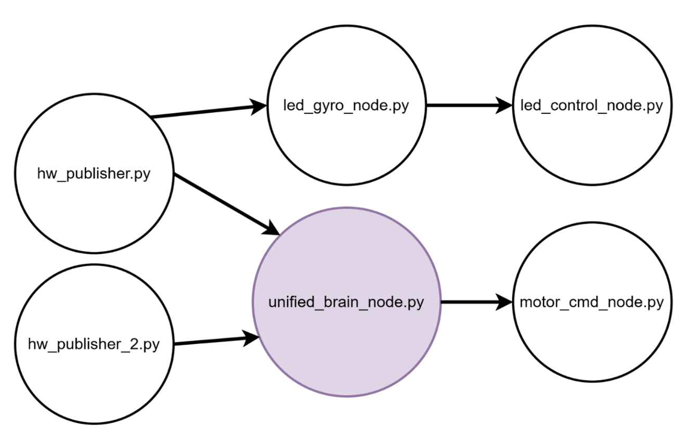
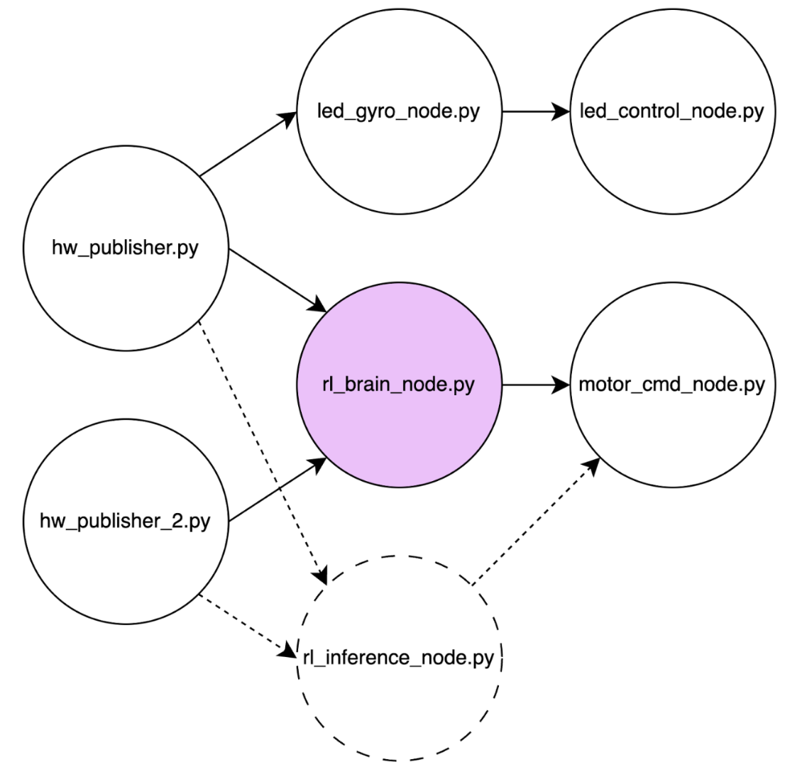

# Pollux-AMR · Software Report  
*Version 2.0 — 27 Apr 2025*

## Table of Contents
1. Module overview  
2. Dependency graph  
3. Dev & build toolchain  
4. Fresh install  
5. Runtime operations  
6. Testing & CI  
7. Future improvements

---

## 1 · Module Overview

| Node / Module | Purpose | Key details |
|---------------|---------|-------------|
| hw_publisher.py | Publishes /pollux/imu & /pollux/ultrasonic_hw | RPi-GPIO, smbus2, 30 Hz |
| hw_publisher_2.py | Publishes /pollux/ultrasonic_2 | RPi-GPIO, smbus2, 30 Hz |
| motor_cmd_node.py | Drives H-bridge from /pollux/motor_cmd | PWM 1 kHz, watchdog |
| led_control_node.py | Controls UV & status LEDs | ROS service /led_mode |
| led_gyro_node.py | Shuts UV when |roll|>15° | Subscribes /pollux/imu |
| rl_brain_node.py | PPO agent, train/infer | Stable-Baselines3 3.5.0 |
| pollux-robot.service | systemd unit | — |

---

## 2 · Dependency Graph



---

## 3 · Dev & Build Toolchain

| Layer | Version | Notes |
|-------|---------|-------|
| OS | Ubuntu 20.04.6 arm64 | CMA = 512 MB |
| Kernel | 5.15.0-1040-raspi | — |
| ROS | Noetic 1.16.0 | — |
| Python | 3.10.12 | - |
| Stable-Baselines3 | 3.5.0 | PyTorch 2.1.0 CPU |
| Gymnasium | 0.29.1 | — |
| CMake | 3.28.1 | optional motor lib |
| CI | GitHub Actions | lint + tests |

---

## 4 · Fresh Install

### 4.1 · Pi Imaging  
Flash *ubuntu-20.04.6-preinstalled-server-arm64+raspi.img.xz*, enable SSH, set hostname *pollux*.

### 4.2 · Base Packages
    ```bash
    sudo apt update && sudo apt upgrade -y
    sudo apt install -y ros-noetic-ros-base python3-rosdep \
        python3-rosinstall python3-rosinstall-generator \
        python3-wstool build-essential
    sudo rosdep init && rosdep update
    ```

### 4.3 · Project Stack  
    ```bash
    git clone https://github.com/<your-org>/pollux-AMR.git
    cd pollux-AMR
    chmod +x setup_env.sh && ./setup_env.sh
    ```
*(script installs Python deps, udev rules, enables pollux-robot.service)*

---

## 5 · Runtime Operations

| Mode | Command | Description |
|------|---------|-------------|
| Auto-start | sudo systemctl enable --now pollux-robot | Boots nodes; logs via *journalctl -u pollux-robot -f* |
| Manual | roslaunch pollux_amr all.launch | Same node set, easier debugging |
| RL Train | rosrun pollux_amr rl_brain_node.py --train | Saves model every 5 min |
| RL Infer | rosrun pollux_amr rl_brain_node.py --infer ~/models/best.zip | Low RAM |

---

## 6 · Future Improvements  
* ONNX Runtime for faster inference  
* pigpio waveforms for non-blocking ultrasonic timing  
* ROS dynamic-reconfigure for live tuning  
* GitOps OTA via fluxcd